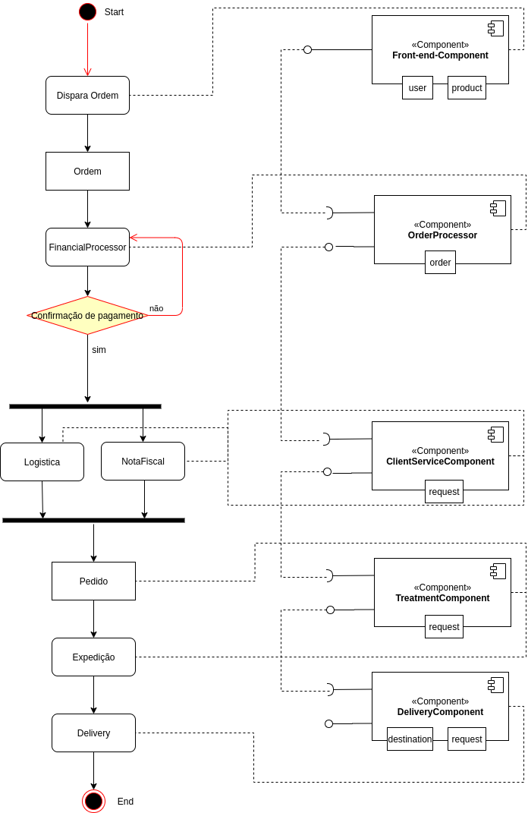
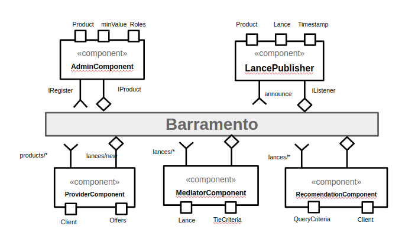

## Tarefa 1 - Diagrama de Atividade - Pedido
> 
> 

## Tarefa 2
>
> 
>

## Tarefa 3
> Coloque as imagens PNG da captura de quatro telas do seu aplicativo:
> * tela 1 - nenhum produto selecionado
>  
> * tela 2 - primeiro produto selecionado
> 
> * tela 3 - segundo produto selecionado
> 
> * tela 4 - compra de um dos produtos efetiva
> 
> * tela 5 - diagrama de blocos do aplicativo
> 
>
>
> [Link Arquivo do projeto App Inventor .aia](app/tarefa3.aia).
