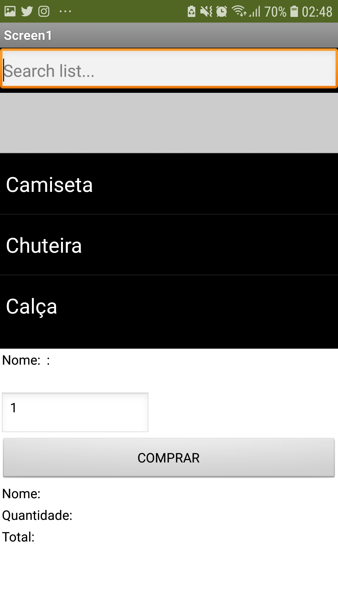

## Tarefa 1
> Coloque a imagem do PRNG do seu diagrama como ilustrado abaixo:
> 
> 

## Tarefa 2
> Coloque a imagem do PNG do seu diagrama como ilustrado abaixo:
>
> 
>
> Nesta tarefa não há um diagrama de atividades. O leilão é um processo que emerge da interação dos componentes. Liste a seguir qual a sequência esperada de ações que emergirá da interação como uma lista. Quando ser referir a uma mensagem, indique o tópico/interface envolvido. Exemplo:
> 1. o componente X posta uma mensagem com o tópico Y;
> 2. os componentes do tipo A que assinam o tópico X fazem Z e postam uma mensagem com o tópico W.

## Tarefa 3
> Coloque as imagens PNG da captura de quatro telas do seu aplicativo:
> * tela 1 - nenhum produto selecionado
>  
> * tela 2 - primeiro produto selecionado
> 
> * tela 3 - segundo produto selecionado
> 
> * tela 4 - compra de um dos produtos efetiva
> 
> * tela 5 - diagrama de blocos do aplicativo
> 
>
>
> [Link Arquivo do projeto App Inventor .aia](app/tarefa3.aia).
