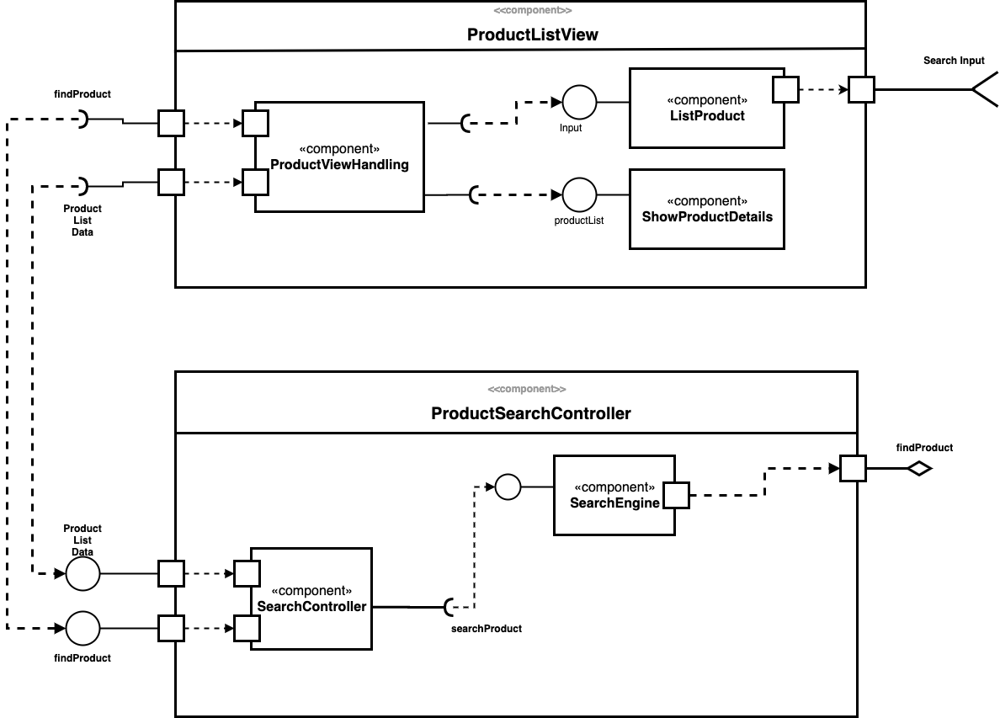

# Tarefa 1




--

# Tarefa 2

*HTML*
```
<div id="root"></div>
```

*Javascript*
```

import React from "react";

class ComponentZero extends React.Component {
  render(){
    var appender = "<li>";
    for (var item : props.itens){
        appender += <li>item</li>;
    }
    appender += "</li>"
    return (
      <div>
        <h4>{appender}</h4>
      </div>
    )
  }
}

export default ComponentZero;
```

```
import React from "react";

const ComponentOne = ({ title }) => <h2>{title}<ComponentOne</h2>
export default ComponentOne;
```

```
import React from "react";

  class ComponentTwo extends React.Component {
    constructor(props){
      const { title, ... } = props;
      this.title = title
    }
    render() {  
      return <h2>{title}</h2>;
    }
  }

  export default ComponentTwo;
```

```
const list = ["Item1", "item2", "Item3", "Item4"];
const rootElement = document.getElementById("root");
ReactDOM.render(
  <>
    <ComponentOne title = "Title 1" />
    <ComponentTwo title = "Title 2" />
    <ComponentZero itens = {list} />
  </>,
  rootElement
);
```
